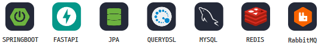
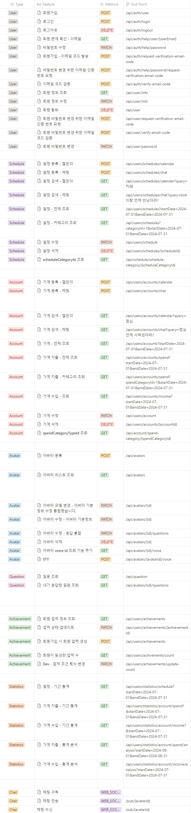
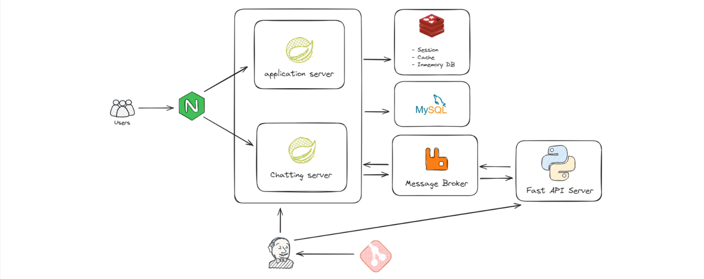
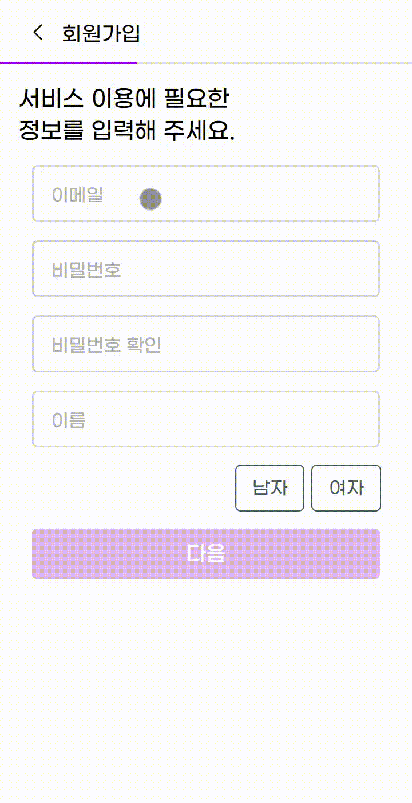
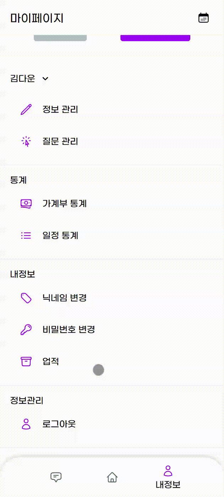
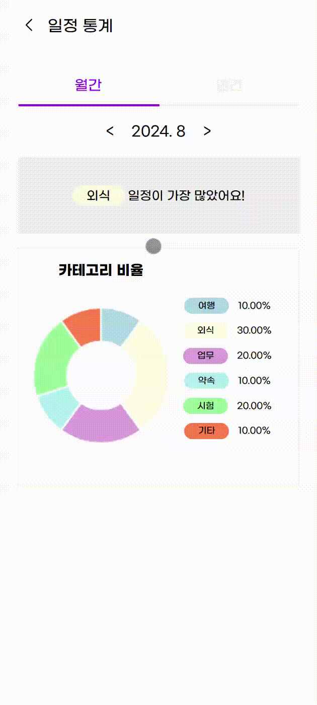

# Mine - 바쁜 일상을 도와주는 나만의 비서

  

## 📑 프로젝트 개요

- **프로젝트명**: Mine
- **프로젝트 진행 기간**: 2024-07-08 ~ 2024-08-16

## 🌄 기획 배경

<!--

**_"우리의 삶 속에 자연스럽게 스며들 수 있는 서비스를 만들어보자."_**

그렇게 생각해낸 것이 `가계부` `AI 비서` `챗봇` 이 3가지 키워드입니다.

그런데, 이 세 단어를 보면 떠오르는 서비스가 있습니다.

뱅크샐러드, ChatGPT, 빅스비와 같이 이미 유명한 서비스가 떠오릅니다.

#### 기존 서비스들을 조합하면 괜찮은 시너지가 나올 것 같은데..

#### 하나의 서비스로 모든 것을 해보면 좋지 않을까?

_"**뱅크샐러드**의 가계부 시스템에 **GPT**의 intelligence 기능이 더해진다면?"_

_"개인형 AI 서비스 **빅스비**에 **GPT**의 실시간 학습 능력이 더해진다면?"_

_"**빅스비**의 대화형 인터페이스가 **뱅크샐러드**의 가계부 시스템에 더해진다면?"_

-->

## 👨‍👨‍👧‍👧 팀원 소개

| 팀원   | 역할            |
| ------ | --------------- |
| 김현진 | 팀장, BE, CI/CD |
| 최요하 | FE, CI/CD       |
| 권용진 | BE              |
| 정재훈 | BE              |
| 김다운 | FE              |
| 조선미 | FE              |

## 🛠️ 프로젝트 개발 도구

**형상 관리**: GitLab

**이슈 관리**: Jira

**커뮤니케이션**: Notion. MatterMost

**디자인**: Figma

**CI/CD**: Jenkins

**IDE**:

- **Backend**: IntelliJ
- **Frontend**: Visual Studio Code 1.92

## 💻 개발 환경

| Backend | Version |
| ------- | ------- |
| JVM | 21.0.11 (Amazon Corretto OpekJDK) |
| MySQL | 8.3.0 |
| AWS EC2 Ubuntu | 20.04.3 LTS |

| Frontend   | Version |
| ---------- | ------- |
| Node.js    | 20.16.0 |
| Npm        | 10.8.1  |
| React      | 18.3.1  |
| TypeScript | 4.9.5   |

## 🛠️ Tech Stack

### Backend

### Frontend

## 📃 ERD

## 📃 API 명세서

## 🗼 백엔드 아키텍처

## 📝 와이어프레임

## 📺 시연

### 로그인 및 회원가입

- 반드시 회원가입 후 로그인을 해야 서비스를 이용할 수 있습니다.
- 회원가입은 사용자의 아이디, 비밀번호, 이메일, 이름, 성별을 입력받고, 이메일 인증 절차를 거쳐야 회원가입을 완료할 수 있습니다.

### 일정

- 사용자의 일정을 관리하는 기능입니다.
- 일정의 카테고리, 제목, 내용(_선택_), 장소(_선택_), 시작일, 종료일을 입력하면 일정을 추가할 수 있습니다.
- 일정이 등록된 날짜는 달력에 표시되며, 기간별(일간,주간,월간), 카테고리별 조회가 가능합니다.
- 일정 검색은 일반적인 키워드 검색과, GPT를 활용한 AI 검색이 가능합니다.

### 가계부

- 사용자의 수입, 지출 내역을 관리할 수 있는 가계부 기능입니다.
- 수입/지출 여부, 카테고리, 제목, 내용(_선택_), 금액, 날짜를 입력하면 가계부를 등록할 수 있습니다.
- 가계부가 등록된 날짜는 달력에 표시되며, 시작일과 종료일을 정하여 조회할 수 있고, 카테고리와 수입/지출 여부에 따라 조회할 수 있습니다.
- 가계부 검색 또한, 일반적인 키워드 검색과, GPT를 활용한 AI 검색이 가능합니다.

### 홈

- 사용자가 선택한 아바타를 3D로 렌더링하여, 터치를 통한 상호작용이 가능합니다.
- 오늘의 일정과 이번달 소비, 지출 금액을 간략하게 조회할 수 있습니다.
- 간단하게 아바타와 채팅이 가능합니다.

### 채팅

- 홈 화면과 달리 좀 더 고도화된 채팅을 진행할 수 있습니다.
- 채팅방처럼 기존 대화 내역을 볼 수 있고, 채팅 내용을 텍스트로 입력할 뿐만 아니라 STT를 활용하여 직접 말을 하여 대화할 수 있습니다.
- 또, 좌측 하단의 채팅 타입을 변경하여, 아바타와 1대1 대화 뿐만 아니라 일정, 가계부를 채팅을 통해 등록할 수 있습니다.

### 업적

- 사용자가 서비스를 이용하면서 특정 조건을 만족하면, 업적을 달성할 수 있습니다.
- 업적의 종류와 진행도를 조회할 수 있습니다.
- 업적 목록에 보이지 않은 이스터에그도 존재하며, 이스터에그를 포함한 모든 업적을 달성하면 숨겨진 기능을 실행할 수 있습니다.

### 통계

#### 가계 통계

- 사용자의 가계를 분석한 통계를 기간별로 볼 수 있습니다.
- 단순히 카테고리와 금액만 보여줄 뿐만 아니라, GPT를 활용해 사용자의 소비 패턴을 분석한 메세지를 출력합니다.

#### 일정 통계

- 사용자의 일정을 분석한 결과를 보여줍니다.

### 마이페이지

- 마이페이지 및 사용자의 정보 변경

### 정보 관리

- 아바타를 학습하는 데 사용한 정보와 질문을 다시 조회하거나 수정할 수 있습니다.
- 수정할 경우 수정할 정보를 바탕으로 재학습을 진행합니다.

