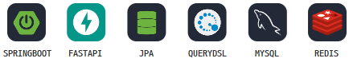
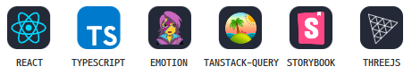
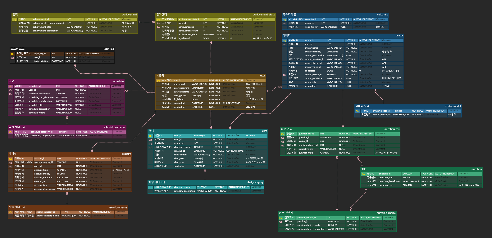
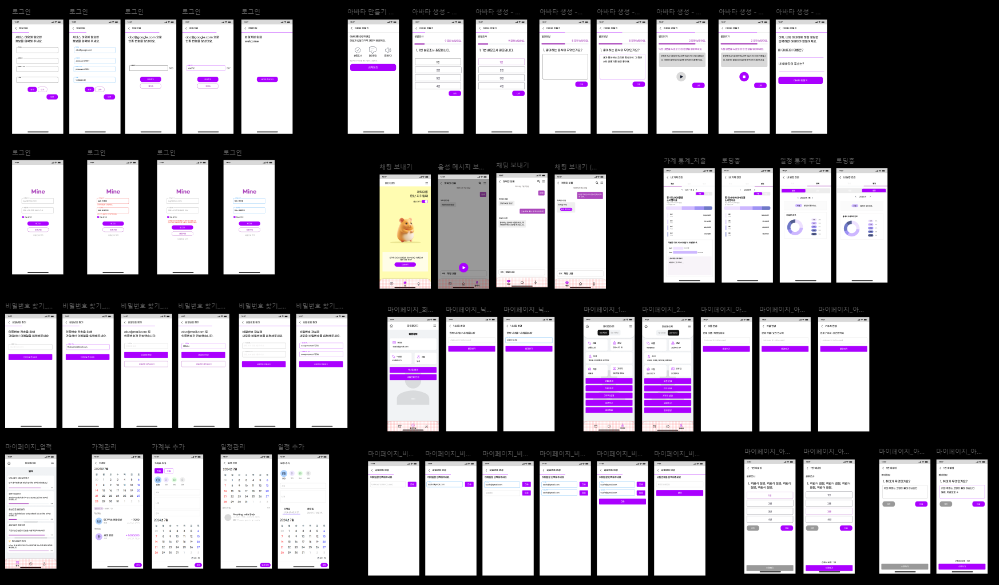
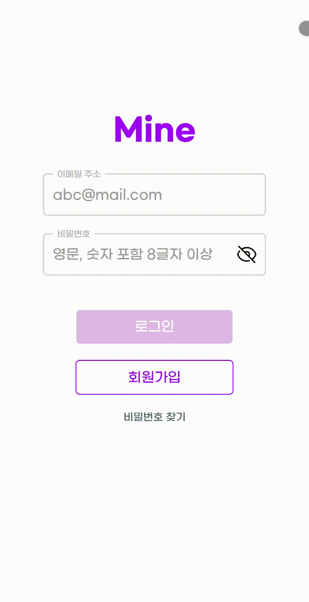
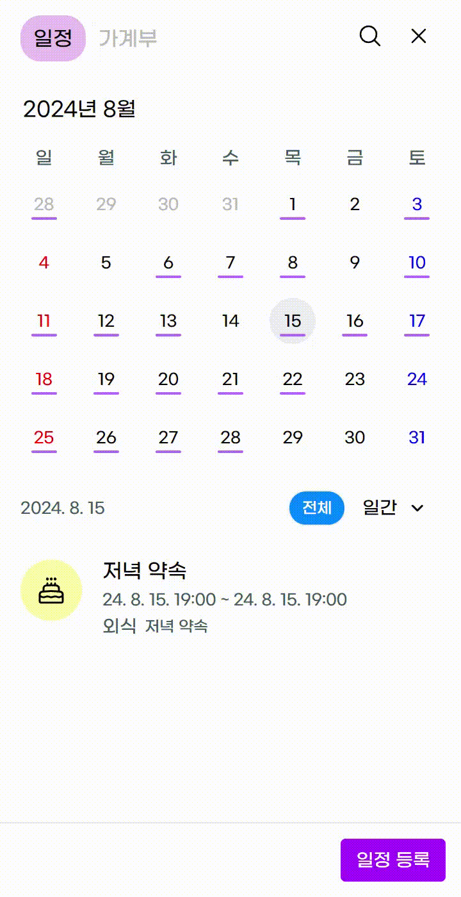
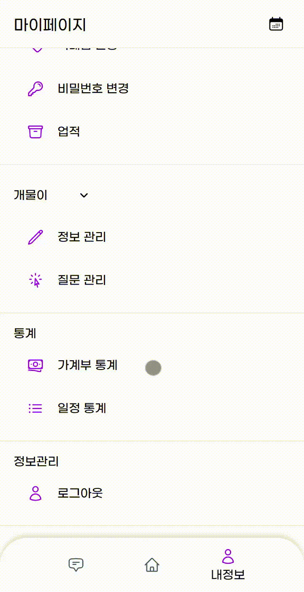

# Mine

  

## 프로젝트 개요

[나만의 AI 비서 서비스 **Mine**](https://99zdiary.com/)

ㅁㄴㅇ

## 🛠️ Tech Stack

### Backend

### Frontend

## ERD

## API 명세서

## 백엔드 아키텍처

## 와이어프레임

### 로그인 및 회원가입

### 일정

### 가계부

### 업적

### 통계

### 채팅

음성으로 등록하기

채팅3

### 마이페이지

마이페이지 및 정보 변경

### 정보 관리

정보 관리 및 질문 관리
